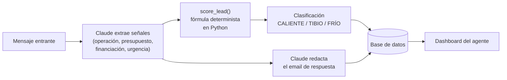

# Inmuebia

Cualificación automática de leads inmobiliarios con IA — un agente que analiza cada
mensaje que le llega a una inmobiliaria, lo puntúa del 1 al 10, y redacta la
respuesta, todo en segundos.

**Demo en vivo:** [inmuebia.es](https://www.inmuebia.es)

---

## El problema

En el sector inmobiliario español, el agente que responde primero se lleva la
operación. Un lead que se enfría 24h porque nadie lo miró es una venta perdida. Las
agencias pequeñas no tienen un CRM que priorice por ellas — todo entra en la misma
bandeja, sin distinguir a quien quiere comprar ya de quien solo pregunta precios.

Inmuebia resuelve eso: cada mensaje entrante (formulario, email, WhatsApp) se
analiza, se puntúa según intención real de compra/venta, presupuesto, financiación
y urgencia, y se genera una respuesta personalizada lista para enviar — sin que el
agente tenga que leerlo primero para decidir si merece la pena.

## Cómo funciona



La pieza que más cuidado ha llevado es esta separación deliberada entre **extraer
señales** (tarea de comprensión del lenguaje → se le da a Claude, con una única
llamada que aprovecha para extraer Y redactar el email a la vez) y **puntuar**
(tarea de negocio con reglas claras y auditables → se queda en Python puro,
determinista, sin coste de IA y con el mismo resultado siempre para las mismas
señales). Cambiar cómo se puntúa no necesita tocar cómo se entiende el mensaje, y
viceversa.

## Algunos problemas reales que salieron al construirlo

- **Negaciones que invertían el significado.** Un regex inicial para detectar
  financiación resuelta hacía *match* en la subcadena positiva de su propia
  negación: `"no tengo la hipoteca aprobada"` contiene literalmente `"hipoteca
  aprobada"`. Ningún regex generaliza esto de verdad — la solución de fondo fue
  mover la extracción de señales a Claude, que entiende negaciones por contexto en
  vez de por patrones de texto.
- **Un SDK que cambió de forma silenciosa.** La sincronización de asientos
  facturables de Stripe (factura por agente, no a precio plano) dejó de funcionar
  sin ningún error visible: `stripe-python` 15.x dejó de soportar `.get()` sobre
  sus objetos (`'get' is a dict method, but a Subscription is not a dict`). El fallo
  se tragaba silenciosamente en un `except` pensado para no romper la petición que
  lo llamaba — así que Stripe seguía cobrando el precio antiguo sin que nadie se
  enterara. Se reprodujo con una suscripción de prueba real y se corrigió el
  indexado; los tests que lo cubrían usaban un `dict` de mentira que ocultaba
  exactamente este fallo, así que también se corrigieron los mocks para usar
  objetos reales del SDK.
- **Facturación por asiento con prorrateo real.** El plan Agencia se cobra por
  número de agentes (mínimo 2), sincronizado con Stripe cada vez que se añade o
  quita un miembro del equipo, con prorrateo automático.

## Stack

| | |
|---|---|
| **Backend** | FastAPI · SQLAlchemy (SQLite en dev, PostgreSQL en prod) · pytest (211 tests) |
| **Frontend** | Next.js 14 (App Router) · React 18 |
| **IA** | Claude (Anthropic) — extracción de señales + redacción, con `tool_choice` forzado a un schema |
| **Auth** | Clerk |
| **Pagos** | Stripe (suscripciones, facturación por asiento, webhooks) |
| **Observabilidad** | Sentry (backend y frontend) |
| **Infra** | Render (API) · Vercel (dashboard) |

## Estructura del repo

```
lead-qualifier/   Backend FastAPI — API, lógica de puntuación, tests
dashboard/        Frontend Next.js — dashboard del agente, landing, checkout
scripts/          Scripts de prueba/mantenimiento puntuales
wordpress-plugin/ Plugin de captación embebible para webs en WordPress
```

## Correr el proyecto en local

```bash
# Backend
cd lead-qualifier
cp .env.example .env   # rellenar con tus claves
pip install -r requirements.txt
uvicorn main:app --reload

# Frontend
cd dashboard
cp .env.example .env.local
npm install
npm run dev
```

Detalle completo de variables de entorno en cada `.env.example`. Guía de
despliegue a producción en [`DEPLOY.md`](DEPLOY.md).

## Tests

```bash
cd lead-qualifier
pytest
```
